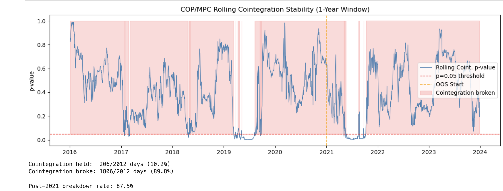

# Statistical Arbitrage in US Energy Equities

## Cointegration-Based Pairs Trading with Out-of-Sample Validation

---

## Abstract
This project implements a statistical arbitrage strategy on US energy sector equities using Engle-Granger cointegration testing. Two cointegrated pairs were identified in-sample (2015–2020) from a universe of six major energy firms. Out-of-sample evaluation (2021–2023) revealed near-zero edge, with rolling stability analysis identifying structural breakdown of the cointegrating relationship as the primary cause.

---

## 1. Motivation
Producers and refiners exhibit structural price relationships due to:
- Crack spreads  
- Crude oil exposure  
- Shared macroeconomic drivers  

---

## 2. Data
- **Universe:** 6 US energy equities  
- **Time period:** 2015–2024  
- **Source:** `yfinance` (adjusted close prices)  
- **Transformation:** Log prices  

**Train/Test Split**
- In-sample (IS): 2015–2020  
- Out-of-sample (OOS): 2021–2023  
- Cutoff date: `2020-12-31`  

---

## 3. Methodology

### Cointegration Screening
- Engle-Granger test applied to all **15 possible pairs**
- Screening performed strictly in-sample

### Stationarity Validation
- Augmented Dickey-Fuller (ADF) test on spread

### Hedge Ratio Estimation
- Ordinary Least Squares (OLS)

### Signal Construction
- 60-day rolling z-score of spread  
- Entry: **±2σ**  
- Exit: **±0.5σ**

### Backtesting Protocol
- Parameters fixed after IS period  
- No recalibration during OOS  

---

## 4. Results

| Metric           | IS (COP/MPC) | OOS (COP/MPC) |
|----------------|-------------|--------------|
| Sharpe Ratio    | 0.704       | 0.013        |
| Annual Return   | 14.17%      | 0.18%        |
| Max Drawdown    | -25.68%     | -25.08%      |

---

## 5. Rolling Stability Analysis

<p align="center">
  
</p>

<p align="center">
  <em>Rolling Engle-Granger cointegration p-values using a 1-year window. The relationship is only intermittently significant, indicating substantial structural instability and explaining weak out-of-sample performance.</em>
</p>

- Cointegration held on **10.2%** of days overall
- Post-2021 breakdown rate: **87.5%**
- Static full-sample testing masked unstable rolling dynamics

---

## 6. Limitations

- **Survivorship Bias:** Universe restricted to currently listed firms  
- **Static Hedge Ratio:** No dynamic beta adjustment  
- **Execution Assumptions:** End-of-day fills assumed  
- **Regime Sensitivity:** Macro shocks (e.g., 2022 energy crisis) disrupted relationships  
- **Limited Universe:** Only 6 tickers, 2 tradable pairs  

---

## 7. Further Work

- Kalman filter for dynamic hedge ratio estimation  
- Regime detection to pause trading during breakdowns  
- Expansion to multi-sector universe  
- Transaction cost optimization via trade frequency control  

---

## Tech Stack
- Python  
- pandas, numpy  
- statsmodels  
- yfinance  
- matplotlib / seaborn  

---
## Reproducing the Analysis

Install dependencies with:

```bash
pip install yfinance pandas numpy scipy statsmodels matplotlib seaborn jupyter

## Author
**Garvikaa Aggarwal**  
Georgia Tech — Mathematics (Probability & Statistics)  
